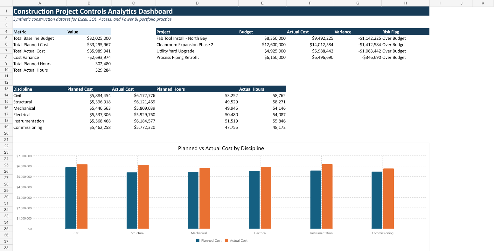

# Construction Project Controls Analytics

Excel, SQL, and Power BI-ready construction project controls analytics portfolio project.

## Dashboard Preview

## Business Problem

Construction project data is often spread across cost, schedule, procurement, and resource files. This project shows how those data sources can be structured and analyzed to create project status reporting and risk indicators.

## Objective

Analyze synthetic construction project data to answer:

- Which projects are over budget?
- Which disciplines have the largest cost variance?
- Which tasks or purchase orders may create project risk?
- How can cost, schedule, resource, and procurement data support leadership reporting?

## Tools Used

- Microsoft Excel
- SQL
- Power BI-ready CSV datasets
- Project controls reporting concepts

## Project Files

| File | Purpose |
|---|---|
| `projects.csv` | Project name, location, status, dates, and baseline budget |
| `schedule_tasks.csv` | Task-level schedule details and completion status |
| `cost_actuals.csv` | Planned cost, actual cost, and cost variance |
| `resource_hours.csv` | Planned vs actual labor hours |
| `procurement_log.csv` | Purchase order, vendor, committed cost, and delivery risk |
| `construction_project_controls_dashboard.xlsx` | Excel dashboard workbook |
| `01_create_tables.sql` | SQL script to create database tables |
| `02_analysis_queries.sql` | SQL queries for cost, schedule, resource, and procurement analysis |
| `excel_dashboard_preview.png` | Dashboard screenshot |

## Key Metrics

- Baseline budget
- Planned cost
- Actual cost
- Cost variance
- Planned hours
- Actual hours
- Schedule status
- Procurement delivery risk

## SQL Skills Demonstrated

- `CREATE TABLE`
- Primary and foreign key structure
- `SELECT`
- `JOIN`
- `GROUP BY`
- `SUM`
- `CASE`
- Project risk indicators
- Reusable reporting view

## Excel Skills Demonstrated

- Dashboard layout
- KPI summary cards
- Planned vs actual cost analysis
- Cost variance reporting
- Chart-based visual reporting
- Multi-sheet workbook structure

## Key Insights

- The project portfolio is over budget because total actual cost is higher than total planned cost.
- Instrumentation has the highest actual cost among all disciplines.
- SQL queries help identify project-level cost variance and potential schedule or procurement risks.
  
## Business Value

This project demonstrates how a data analyst can combine multiple project control datasets and create reporting outputs that help leadership monitor cost, schedule, labor, and procurement risk.

## Resume Bullet

Built a construction project controls analytics project using Excel, SQL, and Power BI-ready datasets; integrated cost, schedule, procurement, and resource data to create project risk indicators, variance reporting, and executive dashboard visuals.
